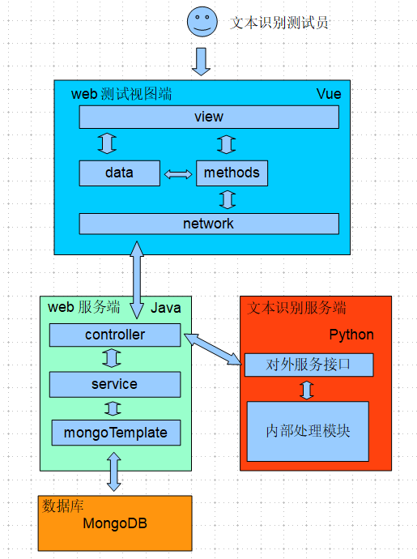

# 文本识别模型测试系统

这里是中国大学生外包服务大赛河南大学666666团队的仓库，用来存放团队的相关比赛资源
## 应用架构图

### 架构图描述

整个应用大致分为web前端(vue)、web服务端(java)、文本识别服务端、数据库(mongodb)四个大模块。

web前端：测试人员可见接口部分，测试人员通过浏览器与之交互，操作数据并通过网络远程测试文本识别模型的好坏。主要有视图模块(view)，本地数据模型(data)，相关函数集(method)，网络服务模块(network)。

web服务端：为前端页面的各种数据提供服务接口，主要用来远程操作数据库，远程调用文本识别服务端的对外服务接口，处理从web前端获取到的数据并配合其他服务一起完成处理这些数据的目的。从层次上看，主要有控制层，服务程，实体层。

文本识别服务端：系统的核心处理模块，为web前端和web服务端提供服务接口，完成数据的处理（猜的(￣▽￣)"）......

数据库：负责存储整个应用产生的数据。数据库主要有problem和reply两个集合，分别负责存储问题和回答，具有天然的高可扩展性。其中problem集合表结构为（questionId、question、standardAnswer、scoringPoint），reply集合表结构为（answerId、questionId、answer、systemScore、scoringDetailed）。

